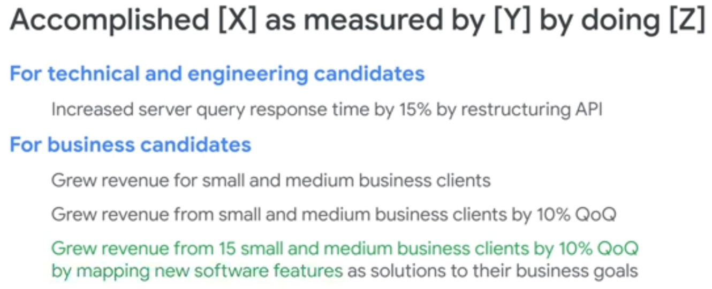
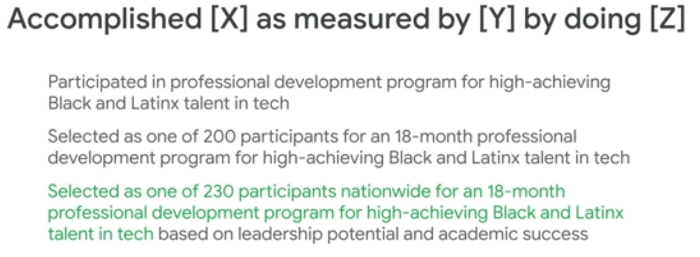

# Resume Generator

----------------------

## OVERVIEW

This project contains my personal resume or CV. It uses [jsonresume](https://jsonresume.org/) [hackmyresume](https://github.com/hacksalot/HackMyResume) format to save and display the resume in PDF and HTML format.

> The **main repository** is hosted in [gitlab.com](https://gitlab.com/patricioperpetua/resume) but it is automaticaly mirrored to [github.com](https://github.com/patricioperpetua/resume.git). If you are in the Github page it may occur that is not updated to the last version.

You can check the last built resume in gitlab pages following:

* [https://patricioperpetua.gitlab.io/resume/](https://patricioperpetua.gitlab.io/resume/)
* [https://patricioperpetua.gitlab.io/resume/index.pdf](https://patricioperpetua.gitlab.io/resume/index.pdf)

## HOW TO USE IT

### INSTALATION

Inside **scripts/installers** folder there is everything to install all the necesary binaries. It is based on npm modules, so it is a **requirement to have installed nodejs**.

To install just type:

```bash
./scripts/installers/installer_all.sh
```

> **DISCLAIMER:** for some reasons I'm not aware, depending of which version of wkhtmltopdf are you using, It is how the PDF will render. So, be my guest to install the version you like from [https://wkhtmltopdf.org/downloads.html](https://wkhtmltopdf.org/downloads.html).

### STRUCTURE

Under **src** folder, jsons files are placed. Inside that folder, a file called basics.json can be found. This file was created to save all basic information such as name, email, information contact and so on.

Then, for each specific language, a folder is created. Inside language folder there can be 2 or 3 files:
    * **jrs.json:** contains the breaf resume, the one that must feet in one page. It is used to created the pdf version to fill out job offers.
    * **option.json:** contains titles replacements when resume is not in English language.
    * **complement-jrs.json (optional)**: contains the full version of the resume. It complements the breaf resume in order to have a more extended document. It is used to generate the HTML version of the resume.

### EXECUTION

Once files were filled and binaries installed, just type:

```bash
./scripts/builder.sh
```

PDF and HTML files will be placed inside **builds** folder.

To change the themes, go to **scripts/config.sh** and change the values THEME_PDF and THEME_HTML.

There is also a script to generate the resume in every available theme. It will place files under **builds/all** folder.

```bash
.scripts/build_all_themes.sh
```

## TIPS

In order to create a really good resume, you can see this video of Google Resume Tips.

[](https://www.youtube.com/watch?v=BYUy1yvjHxE)

If you want to skeep that part and go directly to a very usefull tip, this is the one I follow:





## BRANCHING MODEL

* Default branch when pull is **DEVELOP**.
* Master branch is protected and it is not possible to push. Create a merge request instead.

## DEPLOYMENT

Each branch or tag generate the resume in two formats: PDF and HTML.
    * **PDF:** is saved in an amazon S3 instance and in a dropbox folder. Location of the file depends of the branch or tag associated with the file. See above for more details.
    * **HTML:** is saved in an amazon AWS Amplify where an angular APP will take it as an asset to display.

### CONFIGURATION

#### DROPBOX

Follow [this steps](http://99rabbits.com/get-dropbox-access-token/) to get a dropbox api token. Then save it inside gitlab CI/CD variables under the name **DROPBOX_ACCESS_TOKEN**.

#### AMAZON S3

Follow [this guide](https://support.infinitewp.com/support/solutions/articles/212258-where-are-my-amazon-s3-credentials-) to create a bucket inside amazon s3 and create a user with read and write access. Then save the **Access key ID and Secret access key** as
 following: **AMAZON_S3_RESUME_WR_ACCESS_KEY_ID** and **AMAZON_S3_RESUME_WR_SECRET_ACCESS_KEY**.

### LOCATIONS OF FILES

* **MASTER BRANCH:** under path /latest/

* **DEVELOP BRANCH:** under path /staging/

* **TAGS:** under path /${TAG_NAME}/

## DOCKER IMAGES

The image name is: **patricioperpetua/resume**. [See Registry](https://gitlab.com/patricioperpetua/resume/container_registry). Tags are the same names as files locations described above.

The image is based of an nginx image to display the static web page.

## TODO

* [ ] Inside resume put links the others languages.
* [X] Select themes for pdf and html.
* [X] Create scripts to install binaries and generate files.
* [ ] Change scripts from bash to nodejs.
* [X] Split resume in basic, common and complementary.
* [X] Document how to use repository.
* [X] Generate build script.
* [X] Fix packer script.
* [X] Config gitlab ci/cd.
* [X] Add amazon s3 uploader script.
* [ ] Add docker support.
* [X] Test resume schema.
* [ ] Change titles based on language.
* [X] Post resume analysis to gitlab pages and amazon.
* [X] pdf is not rendering well when creating inside gitlab ci/cd.
* [X] Upload every file to dropbox.
* [ ] Create sha signature for every file.
* [ ] Sign pdf.

----------------------

© [Patricio Perpetua](http://patricioperpetua.com), Italy, 2019.
